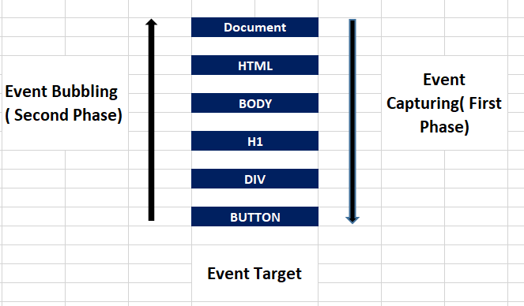
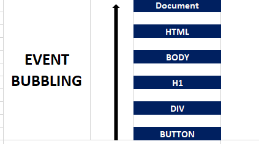

### What are Events in JavaScript?
Events do not only exist in JavaScript but in all programming languages. The primary idea behind events in JavaScript is the ability to run code when a certain event happens. This could be a user clicking a button or any other events you might think of that could trigger some code to run.

Although there’s a distinct difference between events on the browser and server side of JavaScript, the core idea remains the same.

As events transport data, an object is created and given as an argument to the function you set as an event handler. When events occur in JavaScript, an object that contains information about that event gets created. This object will then be passed as an argument to the event handler function. This gives you easy access to the event data and makes it easy to respond as well.  

Here's a more detailed explanation:
 - An event can be called by different actions. Examples are clicks, mouse movements, and time intervals.
 - Javascript creates an event object whenever an event occurs. This object has properties and methods, and provides details about the event.
 - You can set a function that will be executed whenever the event occurs with event handlers in JavaScript.
 - The event object is automatically created whenever the event is triggered This object is therefore passed as an argument to the event handler function.

Let's see what this looks like in code:

```
const button = document.getElementById('check')


button.addEventListener('click', (e) => {
  console.log('Event type: ' + e.type);
  console.log('Target element: ' + e.target);
});


//  The answer

// Event type: click
// Target element: [object HTMLButtonElement]
```

Let us now understand the above code

The function provided as the event handler gets called whenever the click event occurs on the button element. It then receives the event object as the event parameter, which allows for easy access to the properties and data related to the click event.

By gaining access to this event object within the event handler, you can customize your response based on the event data and properties.

There is specific informatioon available inside the event object based on the type of event that occured. For the click event in our example, the included details are the `event.target` and the `event.type`.

### What are Event Handlers?
Event handlers are like a special all-purpose remote control that can perform certain actions like changing channels on your TV, increasing the temperature of your AC, and changing the state of your lighting in your home. But they need a professional to handle a special button attached to it.

The above analogy explains the concepts of event handling in JavaScript. The remote control represents the application you are using. The HTML element-like button on the application is the special button attached to the remote. And the professional that handles the special button is the JavaScript.

Event handling in JavaScript makes applications and webpages responsive and interactive. They do this by defining and managing events and performing specific actions whenever those events occur.

An event handler is any function or method specifically define to respond to a specific event in JavaScript. It is also responsible for the execution of code when a particular event occurs. Here's an example:

```
const button = document.getElementById('check')


button.addEventListener('click', (e) => {
  console.log('Event', e.target)
  console.log('Button click')
});


//  The answer

// Event <button id=​"check">​Check Order​</button>​
// Button click
```

The above code snippet works as follows:
A click event handler is attached to the button element. When the button gets clicked, it logs the something to the console.

When an event occurs, an event object is created by the browser. This object is then passed as an argument to the event handler function. With this, data and properties within the event object can be accessed.

As you hopefully now understand, event handlers are a key part of creating dynamic web applications.

### Event Flow in the DOM
Events are generally processed in three phases in the DOM. They are the capturing, the target, and the bubbling phase.

#### The capturing phase
The first phase is the **capturing phase**, which occurs when an element nested in various elements gets clicked. Right before the click reaches its final destination, the click event of each of its parent elements must be triggered. This phase trickles down from the top of the DOM tree to the target element.

#### The Target Phase
The **target phase** is the second phase that begins immediately after the capturing phase ends. This phase is basically the end of the capturing and the beginning of the bubbling phase.

The target element is the element where the event originally occurred. For example, if you submit a form on a web page, the form element is the target element for the submit event. In the case where there is an event handler on a button on a webpage, the button is the target element for the event handler.

Event handlers registered on the button element are considered to be the target element during this phase.

#### The Bubbling Phase
The bubbling phase, which is the last phase, is the reverse of the capturing phase. In this phase, the event bubbles up the target element through its parent element, the ancestor, to the global window object. By default, all events you add with `addEventListener` are in the bubble phase.



#### What is Event Bubbling?
Event bubbling, as I mentioned above, is the phase where the event bubbles up from the target element all the way to the global window object.

When an event "bubbles up" in the `DOM` event flow context, this refers to a phase in event flow where an event which traditionally occurs after the target phase continues to propagate from the target element to the root of the document through the `DOM` hierarchy.

##### How event bubbling works
The event starts to bubble up through the DOM hierarchy after it has been processed at the target element. The event then travels from the target element to the root of the document. It passes through all ancestor elements according to how they are nested in the bubbling phase.

During an event handler's execution phase, any event handlers registered on ancestor elements get executed. This allows for easy capture of events at various stages of the DOM hierarchy.

This action can be stopped using the stopPropagation() method on the event object. It's useful when you aim to prevent event handlers from the ancestor elements gettomg triggered.

With bubbling, events can be handled in a hierarchical manner. By setting an event handler on the parent element or container, you can handle events from multiple child elements.

Event bubbling allows for an easier implementation of event delegation.



Here's an example of how it works, which I'll explain below:

```
<!DOCTYPE html>
<html lang="en">
  <head>
    <meta charset="UTF-8" />
    <meta name="viewport" content="width=device-width, initial-scale=1.0" />
    <link rel="stylesheet" href="style.css" />
    <title>Practice</title>
  </head>
  <body>
    <h1>Bubbling and Capturing phase</h1>

    <div>
      <button class="child">click me</button>
    </div>

    <script>
      const parent = document.querySelector("div");
      const child = document.querySelector(".child");

      parent.addEventListener("click", function () {
        console.log("clicked parent");
      });

      child.addEventListener("click", function () {
        console.log("clicked child");
      });
    </script>
  </body>
</html>


<!-- 

         RESULTS OF THE ABOVE CODE

         index.html:25 clicked child
         index.html:21 clicked parent
      
 -->
```

Now, let us understand the above code snippet

Inside the body element, we have the h1, div, and the button element. The div is the parent element of the button element. We gave a class name of child for the button element.

In the JavaScript section, we created variables for both the parent and child elements. Then we added event listeners to both the parent and child elements.

Thus, when the button gets clicked, the clicked child is first invoked. This means that the function within the parent element executes after the function within the child element.

##### What is Event Capturing?

Event capturing occurs when a nested element gets clicked. The click event of its parent elements must be triggered before the click of the nested element. This phase trickles down from the top of the `DOM` tree to the target element.  

Event capturing can't happen until the third argument of `addEventListener` is set to the `Boolean` value of true as shown below (default value is false).  

Whenever the third argument of `addEventListener` is set to `true`, event handlers are automatically triggered in the capturing phase. With this, the event handler attached to an ancestor element will be executed first when an event occurs on a nested element within the `DOM` hierarchy. This is unlike the default, where event handlers are triggered during the bubbling phase.

```
<!DOCTYPE html>
<html lang="en">
  <head>
    <meta charset="UTF-8" />
    <meta name="viewport" content="width=device-width, initial-scale=1.0" />
    <link rel="stylesheet" href="style.css" />
    <title>Practice</title>
  </head>
  <body>
    <h1>Bubbling and Capturing phase</h1>

    <div>
      <button class="child">click me</button>
    </div>

    <script>
      const parent = document.querySelector("div");
      const child = document.querySelector(".child");

      parent.addEventListener(
        "click",
        function () {
          console.log("clicked parent");
        },
        true
      );

      child.addEventListener("click", function () {
        console.log("clicked child");
      });
    </script>
  </body>
</html>

<!-- 

       RESULTS OF THE ABOVE CODE

      index.html:25 clicked parent
      index.html:21 clicked child
      
 -->
```

The above is a snippet of HTML and JavaScript code. Inside the body element, we have the `h1`, `div`, and the `button` element.

The div is the parent element of the button element. We gave a class name of child to the button element.

In the JavaScript section, we created variables for both the parent and child elements. We added event listeners to both the parent and child elements as well.

In the parent element, we set the `Boolean` value to "true" for the third argument. The default value is false.

Thus, when the button gets clicked, the clicked parent was first invoked. This means that the function within the parent element executes before the function within the child element.

#### How Does the event.stopPropagation Method Work?
By default, all event handlers are registered in the bubbling phase (from the target element to all its ancestor elements). This default configuration can be modified by adding the `event.stopPropagation` method to the target element.

As its name suggests, the `Event.stopPropagation` method stops propagation. Any other listener for the same type of event on some ancestor element will not trigger their event listener for the event.

```
<!DOCTYPE html>
<html lang="en">
  <head>
    <meta charset="UTF-8" />
    <meta name="viewport" content="width=device-width, initial-scale=1.0" />
    <link rel="stylesheet" href="style.css" />
    <title>Practice</title>
  </head>
  <body>
    <h1>Bubbling and Capturing phase</h1>

    <ul>
      <li>Kamal</li>
      <li>Lawal</li>
      <li>Olaide</li>
      <li>Ayinde</li>
    </ul>

    <script>
      const parent = document.querySelector("ul");
      const li = document.querySelectorAll("li");

      parent.addEventListener("click", function () {
        console.log("clicked parent");
      });

      li.forEach(function (list) {
        list.addEventListener("click", function () {
          event.stopPropagation();
          event.target.classList.toggle("highlight");
        });
      });
    </script>
  </body>
</html>
```

Unlike the default, `event.stopPropagation` will prevent the parent element `ul` from showing in the console. Note that the `event.stopPropagation` method can also be used in the capturing phase.

#### What is Event Delegation?

Imagine your office without a manger. This office is likely going to be less efficient than one with a manager. Managers don't do or oversee every task individually – instead, they will delegate responsibilities to their employees. This delegation allows the manager to efficiently manage the workload, and then step in if something goes wrong.

Event delegation in JavaScript is similar to the above example, as it makes it easier to manage and handle events on multiple child elements. It takes advantage of the `DOM` (Document Object Model) bubbling event. This means setting event listeners on ancestor elements allows you to handle events efficiently. Unlike setting event listeners on individual elements that trigger the events. Recall that in the bubbling phase, the events on the child element rise to their parent element.

Check the below code to help you understand how this works:

```
<!DOCTYPE html>
<html lang="en">
  <head>
    <meta charset="UTF-8" />
    <meta name="viewport" content="width=device-width, initial-scale=1.0" />
    <link rel="stylesheet" href="style.css" />
    <title>Practice</title>
  </head>
  <body>
    <ul>
      <li>Orange</li>
      <li>Banana</li>
      <li>Potato</li>
      <li>Apple</li>
    </ul>

    <script>
      const li = document.querySelectorAll("li");

      li.forEach(function (list) {
        list.addEventListener("click", function () {
          alert("Yes, I click");
        });
      });
    </script>
  </body>
</html>
```

In the above code, an event listener was added to each of the `listItems`. Then, whenever they get clicked, an alert pops up. Traditionally, this is not bad code, but it defeats the purpose of event delegation.  In the code below, you'll see the importance of event delegation.

```
<!DOCTYPE html>
<html lang="en">
  <head>
    <meta charset="UTF-8" />
    <meta name="viewport" content="width=device-width, initial-scale=1.0" />
    <link rel="stylesheet" href="style.css" />
    <title>Practice</title>
  </head>
  <body>
    <h1>Bubbling and Capturing phase</h1>

    <ul>
      <li>Kamal</li>
      <li>Lawal</li>
      <li>Olaide</li>
      <li>Ayinde</li>
    </ul>

    <script>
      const ul = document.querySelector("ul");

      ul.addEventListener("click", function () {
        event.target.classList.toggle("highlight");
      });
    </script>
  </body>
</html>
```

Unlike the initial code, the parent of the listItems `ul` will handle the event here. So the parent will delegate the logic we want to achieve to the child. Recall that the `listItems` bubbles up in the `DOM` tree.

But there are some situations where it will be almost impossible to delegate to a child element. For example, it's impossible if the child has a nested child element itself. In this case, it will be impossible to delegate to a child element.

Here's a code example that shows you why it may be impossible to delegate to a child element:

```
<!DOCTYPE html>
<html lang="en">
  <head>
    <meta charset="UTF-8" />
    <meta name="viewport" content="width=device-width, initial-scale=1.0" />
    <link rel="stylesheet" href="style.css" />
    <title>Practice</title>
  </head>
  <body>
    <h1>Bubbling and Capturing phase</h1>

    <ul>
      <li>
        <h2>Orange</h2>
        <p>Kamal</p>
      </li>
      <li>
        <h2>Apple</h2>
        <p>Lawal</p>
      </li>
      <li>
        <h2>Banana</h2>
        <p>Olaide</p>
      </li>
    </ul>

    <script>
      const ul = document.querySelector("ul");

      ul.addEventListener("click", function () {
        event.target.classList.toggle("highlight");
      });
    </script>
  </body>
</html>
```


The above code will not produce the expected output. This is because in our code, we use `event.target`.

In JavaScript, `event.target` is the actual `DOM` element that gets clicked. In this instance, the three possible outcomes are the `li`, `h2`, and the `p`. The code below shows the solution to this problem:

```
<!DOCTYPE html>
<html lang="en">
  <head>
    <meta charset="UTF-8" />
    <meta name="viewport" content="width=device-width, initial-scale=1.0" />
    <link rel="stylesheet" href="style.css" />
    <title>Practice</title>
  </head>
  <body>
    <h1>Bubbling and Capturing phase</h1>

    <ul>
      <li>
        <h2>Orange</h2>
        <p>Kamal</p>
      </li>
      <li>
        <h2>Apple</h2>
        <p>Lawal</p>
      </li>
      <li>
        <h2>Banana</h2>
        <p>Olaide</p>
      </li>
    </ul>

    <script>
      const ul = document.querySelector("ul");

      ul.addEventListener("click", function () {
        event.target.closest("li").classList.toggle("highlight");
      });
    </script>
  </body>
</html>
```

To get the expected result of selecting the listItem, we combine both the `DOM` traversal method with `event.target`.

The `closest` method is available on `DOM` objects. `closest` traverses up in the ancestry tree. You can select the closest element with any CSS selector by ID, tag, or classname. One interesting thing is that `closest` includes the element you call it on, in this case the `li`.