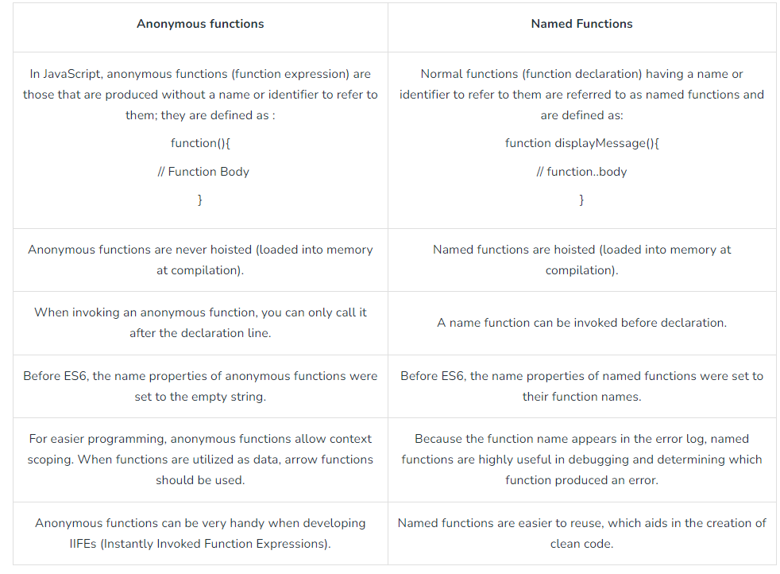

# Functions in JS

> Functions are heart ♥ of Javascript.

### Q: What is Function statement? 
Below way of creating function are function statement.
```js
function a() {
  console.log("Hello");
}
a(); // Hello
```

### Q: What is Function Expression?
Assigning a function to a variable. Function acts like a value.
```js
var b = function() {
  console.log("Hello");
}
b();
```

### Q: Difference between function statement and expression
The major difference between these two lies in **Hoisting**.
```js
a(); // "Hello A"
b(); // TypeError
function a() {
  console.log("Hello A");
}
var b = function() {
  console.log("Hello B");
}
// Why? During mem creation phase a is created in memory and function assigned to a. But b is created like a variable (b:undefined) and until code reaches the function()  part, it is still undefined. So it cannot be called.
```
### Q: What is Function Declaration?
Other name for **function statement**.

### Q: What is Anonymous Function?
A function without a name.
```js
function () {

}// this is going to throw Syntax Error - Function Statement requires function name.
```
- They don't have their own identity. So an anonymous function without code inside it results in an error. 
- Anonymous functions are used when functions are used as values eg. the code sample for **function expression** above.

### Q: What is Named Function Expression?
Same as Function Expression but function has a name instead of being anonymous.
```js
var b = function xyz() {
  console.log("b called");
}
b(); // "b called"
xyz(); // Throws ReferenceError:xyz is not defined.
// xyz function is not created in global scope. So it can't be called.
```

### Q: Parameters vs Arguments?
```js
var b = function(param1, param2) { // labels/identifiers are parameters
  console.log("b called");
}
b(arg1, arg2); // arguments - values passed inside function call
```

### Q: What is First Class Function aka First Class Citizens?
We can pass functions inside a function as arguments and 
/or return a function(HOF). These ability are altogether known as First class function. It is programming concept available in some other languages too.
```js
var b = function(param1) {
  console.log(param1); // prints " f() {} "
}
b(function(){});

// Other way of doing the same thing:
var b = function(param1) {
  console.log(param1);
}
function xyz(){
}
b(xyz); // same thing as prev code

// we can return a function from a function:
var b = function(param1) {
  return function() {
  }  
}
console.log(b()); //we log the entire fun within b. 
```

### Arrow Functions
**Arrow function** {()=>} is concise way of writing JavaScript functions in shorter way. Arrow functions were introduced in the ES6 version. They make our code more structured and readable.

Arrow functions are anonymous functions i.e. functions without a name but they are often assigned to any variable. They are also called **Lambda Functions**.

Advantages of using Arrow functions
 - Arrow functions reduce the size of the code.
 - The return statement and function brackets are optional for single-line functions.
 - It increases the readability of the code.
 - Arrow functions provide a lexical this binding. It means, they inherit the value of “this” from the enclosing scope. This feature can be advantageous when dealing with event listeners or callback functions where the value of “this” can be uncertain.

Disadvantages of Arrow Functions
 - Arrow functions do not have the prototype property.
 - Arrow functions cannot be used with the new keyword.
 - Arrow functions cannot be used as constructors.
 - These functions are anonymous and it is hard to debug the code.
 - Arrow functions cannot be used as generator functions that use the yield keyword to return multiple values over time.

### Higher Order Functions

#### Q: What is Higher Order Function?
**Ans**: Higher-order functions are regular functions that take one or more functions as arguments and/or return functions as a value from it. Eg: 
```js
function x() {
    console.log("Hi");
};
function y(x) {
    x();
};
y(x); // Hi
// y is a higher order function
// x is a callback function
```

Let's try to understand how we should approach solution in interview.
I have an array of radius and I have to calculate area using these radius and store in an array.

First Approach:
```js
const radius = [1, 2, 3, 4];
const calculateArea = function(radius) {
    const output = [];
    for (let i = 0; i < radius.length; i++) {
        output.push(Math.PI * radius[i] * radius[i]);
    } 
    return output;
}
console.log(calculateArea(radius));
```
The above solution works perfectly fine but what if we have now requirement to calculate array of circumference. Code now be like
```js
const radius = [1, 2, 3, 4];
const calculateCircumference = function(radius) {
    const output = [];
    for (let i = 0; i < radius.length; i++) {
        output.push(2 * Math.PI * radius[i]);
    } 
    return output;
}
console.log(calculateCircumference(radius));
```
But over here we are violating some principle like DRY Principle, now lets observe the better approach.
```js
const radiusArr = [1, 2, 3, 4];

// logic to calculate area
const area = function (radius) {
    return Math.PI * radius * radius;
}

// logic to calculate circumference
const circumference = function (radius) {
    return 2 * Math.PI * radius;
}

const calculate = function(radiusArr, operation) {
    const output = [];
    for (let i = 0; i < radiusArr.length; i++) {
        output.push(operation(radiusArr[i]));
    } 
    return output;
}
console.log(calculate(radiusArr, area));
console.log(calculate(radiusArr, circumference));
// Over here calculate is HOF
// Over here we have extracted logic into separate functions. This is the beauty of functional programming.

Polyfill of map
// Over here calculate is nothing but polyfill of map function
// console.log(radiusArr.map(area)) == console.log(calculate(radiusArr, area));

***************************************************
Lets convert above calculate function as map function and try to use. So,

Array.prototype.calculate = function(operation) {
    const output = [];
    for (let i = 0; i < this.length; i++) {
        output.push(operation(this[i]));
    } 
    return output;
}
console.log(radiusArr.calculate(area))
```

#### Difference between anonymous function and named functions
