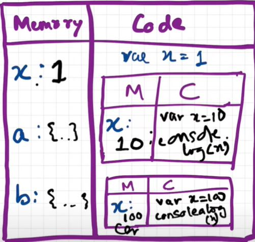

# Hoisting in JavaScript

Lets understand the concept of hoisting in relation with how javascript is executed that we have studied in the previous part.

Consider the below code snippet.
```
getName(); // Namaste Javascript
console.log(x); // undefined
var x = 7;
function getName() {
 console.log("Namaste Javascript");
}
```
In numerous other programming languages, attempting to access something that hasn't been created or defined would typically result in an immediate error. However, in JavaScript, during the memory creation phase, it assigns 'undefined' and stores the function's content in its memory space. During execution, it carries out operations as requested. In this case, since execution happens line by line without prior compilation, the output will only display 'undefined' and not throw an error. This behavior is not considered an error. However, removing 'var x = 7;' would lead to an error. 

**Hoisting** is a concept that allows us to retrieve values of variables and functions before they are initialized or assigned values, all without encountering an error. This capability is made possible by the initial phase, known as the memory creation phase, within the Execution Context.

We've discovered that the execution context is established in two stages. Before the actual code execution begins, memory is allocated. For variables, this results in their initialization as 'undefined,' while for functions, the complete function code is stored in memory. For instance:
```
getName(); // Namaste JavaScript
console.log(x); // Uncaught Reference: x is not defined.
console.log(getName); // f getName(){ console.log("Namaste JavaScript); }
function getName(){
    console.log("Namaste JavaScript");
}
```

Now let's observe a different example and try to understand the output.
```
getName(); // Uncaught TypeError: getName is not a function
console.log(getName);
var getName = function () {
    console.log("Namaste JavaScript");
}
// The code won't execute as the first line itself throws an TypeError.
```

## Functions and Variable Environments
Let us consider the below code snippet
```
var x = 1;
a();
b(); // we are calling the functions before defining them. This will work properly, as seen in Hoisting.
console.log(x); // 3

function a() {
  var x = 10; // localscope because of separate execution context
  console.log(x); // 1
}

function b() {
  var x = 100;
  console.log(x); // 2
}
```
Outputs:
```
10
100
1
```

#### Code Flow using Execution Context
The Global Execution Context (GEC) is created (the big box with Memory and Code subparts). Also GEC is pushed into Call Stack

```
Call Stack: GEC
```
  - In first phase of GEC (memory phase), variable x:undefined and a and b have their entire function code as value initialized
  - In second phase of GEC (execution phase), when the function is called, a new local Execution Context is created. After x = 1 assigned to GEC x, a() is called. So local EC for a is made inside code part of GEC.

```
Call Stack: [GEC, a()]
```
 - For local EC, a totally different x variable assigned undefined(x inside a()) in phase 1 , and in phase 2 it is assigned 10 and printed in console log. After printing, no more commands to run, so a() local EC is removed from both GEC and from Call stack
```
Call Stack: GEC
```
- Cursor goes back to b() function call. Same steps repeat.
  
```
Call Stack :[GEC, b()] -> GEC (after printing yet another totally different x value as 100 in console log)
```
 - Finally GEC is deleted and also removed from call stack. Program ends.

Refer the below image for better understanding

